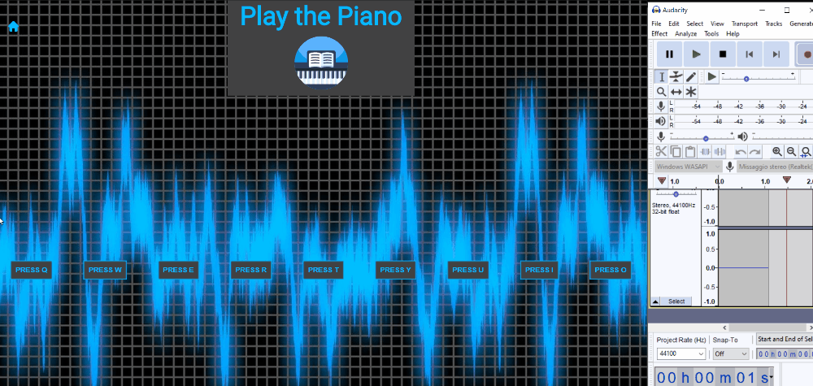

# Play The Piano




'Play the piano' is a simple app that you can use to play sound samples. 
Create your music. 
If you use [Audacity](https://www.audacityteam.org/) you can record the music and save your mp3 file.

### Techno
- HTML
- CSS
- Javascript

## Run
To run this project you can use [http-server](https://www.npmjs.com/package/http-server)

- You need to have [Node.js](https://nodejs.org/) installed in your system.

- Open a CMD or Terminal prompt, run the command:
```
 npm install http-server -g
```

- Navigate to the specific path of your file folder in CMD or Terminal, and run the command 
```
http-server
```

- Go to your browser and type 
```
localhost:8080
```
Your Application should run there.

## License
[MIT](https://choosealicense.com/licenses/mit/)

author ❤️ @
